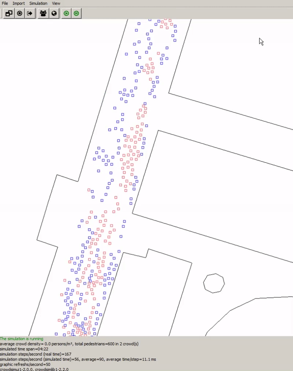

# jCrowdSimulator
jCrowdSimulator is a crowd simulation library and user interface written in [Java](https://www.java.com/). It implements the Social Force Model of [Helbing et al. (2005)](https://pubsonline.informs.org/doi/pdf/10.1287/trsc.1040.0108) / [Helbing et al. 1995](https://journals.aps.org/pre/abstract/10.1103/PhysRevE.51.4282). It supports the [ESRI Shape Format](https://www.esri.com/library/whitepapers/pdfs/shapefile.pdf) and the [OGC Well Known Text Format](https://www.opengeospatial.org/standards/wkt-crs), which can be used to define crowds (point data) and associated routes (point data) they should follow as well as obstacles (point/line/polygon data) that the agents of the crowd try to avoid. Geometry data is handled using [JTS](https://en.wikipedia.org/wiki/JTS_Topology_Suite) / [GeoTools](http://www.geotools.org/) libraries.

## Features
+ Multiple crowds, each having an individual route can be simulated simultaneously
+ Point/Line/Polygon data can be used to define obstacles
+ The outline of crowds can be computed
+ Resulting forces within the simulation can be visualised
+ The simulation library may be used independently from the user interface

## Download
The current version of jCrowdSimulator can be downloaded here: [jCrowdSimulator.jar](jCrowdSimulator.jar).
This version is a runnable jar file that can be directly executed, if a Java Virtual Machine is installed.

[Sample data](sampledata) to test the application is provided.

## Introduction
Follow this introduction [video](https://youtu.be/1Pn2VdOSdPw) to see, how the application can be used.

## Navigation
+ Use +/- buttons on the keyboard or the scrool wheel on the mouse to zoom in/out
+ Use the arrow buttons (top, left, down, right) on the keyboard to move the map

## License
Both, the simulation library and the user interface are under [LGPL v3](https://opensource.org/licenses/lgpl-3.0.html). Thus, they can be used and further developed. Forking and contributing is welcome.

## Credits
The initial version of this software has been developed at [Fraunhofer IVI, Fraunhofer Institute for Transportation and Infrastructure Systems](https://www.ivi.fraunhofer.de/en.html), Dresden during the project [TARGET](http://www.target-h2020.eu/), which received funding from the European Commission within the Horizon 2020 programme (grant number 653350).

Contact: s t e f a n . h a h m a n n (at) i v i . f r a u n h o f e r . d e (without the whitespaces).

